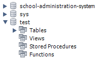
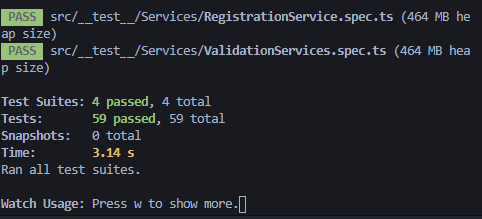
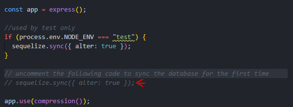
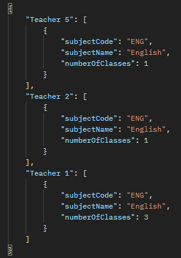

<details open="open">
  <summary><h2 style="display: inline-block">Table of Contents</h2></summary>
  <ol>
    <li>
      <a href="#about-the-project">About The Project</a>
    </li>
    <li><a href="#additional-libraries">Additional Libraries</a></li>
    <li>
      <a href="#additional-setup">Additional Setup</a>
      <ul>
        <li><a href="#prerequisites">Prerequisites</a></li>
        <li><a href="#installation">Installation</a></li>
      </ul>
    </li>
    <li><a href="#apis">API end point</a></li>
    3<li><a href="#assumptions">Assumption and Outstanding Issues</a></li>
  </ol>
</details>
<br/>
<!-- About Project -->

# About The Project

This is a challenge to design and develop the backend API for a school in order for school administrators and teacher to perform various administrative functions.

<br/>

## Additional libraries

---

- [Supertest](https://www.npmjs.com/package/supertest)

- [ts-jest](https://www.npmjs.com/search?q=ts-jest)

- [cross-env](https://www.npmjs.com/package/cross-env)

<br/>

## Additional Setup for testing

---

Set up a test database in mySQL call test. This will be use to run our test cases. You can ignore this step if you do not plan to run the test cases

<p align="center">
  
</p>

Test Runner

```sh
npm run test
```

Expected Output



<br/>

## Prerequisites

---

- Node Version: v14.16.0
- mySQL 8.0 or docker installed

if you do not have docker or plan to run the setup on a local mysql database by removing the following from package.json and updating the .env file with the correct port number and details

```
"start:services": "docker-compose up -d",
```

<br/>

## Installation

---

1. Clone the repo
   ```sh
   git clone https://github.com/github_username/repo_name.git
   ```
2. Install NPM packages
   ```sh
   npm install
   ```
3. Start

   ```sh
   npm run start
   ```

4. If you are running the code the first time, please uncomment this line of code to sync the database for the first time in app.ts



## APIs

---

### Create classes

- **URL** `/api/register`

- **Method**: `POST`

- **Sample Call**

  ```sh
  {
    “teacher”: {
      name: “Teacher 1”,
      email: “teacher1@gmail.com”
    },
    “students”: [{
        name: “Student 1”,
        email: “student1@gmail.com”
      }, {
        name: “Student 2”,
        email: “student2@gmail.com”
      }],
    “subject”: {
      subjectCode: “ENG”,
      name: “English”
      },
    “class”: {
      classCode: “P1-1”,
      name: “P1 Integrity”
    }
  }
  ```

  **Expected Response**

  Success: `204`

  Error: `400 or 500`

---

### Generate workload report

- **URL** `/api/reports/workload`

- **Method**: `GET`

- **Sample Response**

  

  Success: `204`

  Error: `400 or 500`
